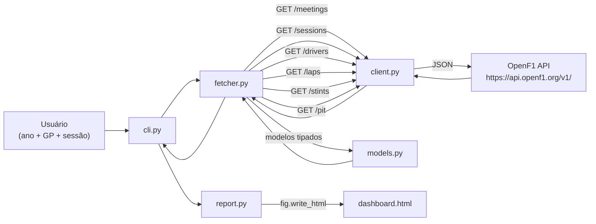

# Arquitetura

## Visão Geral

O projeto é organizado em 5 camadas dentro de `src/f1/`, cada uma com responsabilidade única:

```
src/f1/
├── __init__.py    # exporta os modelos e funções principais
├── client.py      # HTTP client com retry e rate-limit
├── models.py      # dataclasses tipadas para as entidades da API
├── fetcher.py     # orquestra chamadas à API e retorna modelos
├── report.py      # gera o dashboard HTML via Plotly
└── cli.py         # entrypoint de linha de comando (argparse)
```

## Fluxo de Dados



## Descrição das Camadas

### `client.py` — HTTP Client

Responsável por toda a comunicação com a API OpenF1:

- Classe `OpenF1Client(base_url, timeout)`
- Método `get(endpoint, params) -> list[dict]`
- Retry automático em caso de rate limit (HTTP 429): até 3 tentativas com espera de 1s
- Levanta `requests.HTTPError` para outros erros HTTP (4xx, 5xx)
- URL base configurável para facilitar testes com mock

### `models.py` — Modelos de Dados

Dataclasses Python tipadas que espelham as respostas da API:

| Modelo | Campos principais |
|--------|-------------------|
| `Session` | `session_key`, `session_name`, `date_start`, `country_name` |
| `Driver` | `driver_number`, `full_name`, `team_name`, `name_acronym` |
| `Lap` | `driver_number`, `lap_number`, `lap_duration`, setores 1/2/3 |
| `Stint` | `driver_number`, `lap_start`, `lap_end`, `compound`, `tyre_age_at_start` |
| `Pit` | `driver_number`, `lap_number`, `pit_duration` |

Cada modelo tem um método `from_dict(data: dict)` que parseia a resposta JSON. Campos ausentes resultam em `None`.

### `fetcher.py` — Orquestrador

Resolve o fluxo `meeting → session → dados`:

- `resolve_session(client, year, country_name, session_name) -> Session`
- `fetch_drivers(client, session_key) -> list[Driver]`
- `fetch_laps(client, session_key) -> list[Lap]`
- `fetch_stints(client, session_key) -> list[Stint]`
- `fetch_pits(client, session_key) -> list[Pit]`

Levanta `ValueError` com mensagem clara se o GP ou sessão não for encontrado.

### `report.py` — Gerador de Dashboard

Constrói o HTML final:

- `build_lap_comparison_chart(laps, drivers) -> go.Figure` — gráfico de linha Plotly
- `generate_dashboard(session, laps, drivers, stints, pits, output_path)` — monta e salva o HTML

O HTML é gerado com `fig.write_html(include_plotlyjs="cdn")`, carregando o Plotly.js via CDN — sem dependência offline.

### `cli.py` — Interface de Linha de Comando

Entrypoint `f1-dashboard` registrado em `pyproject.toml`:

- Aceita `--year`, `--gp`, `--session`, `--output`
- Orquestra todas as chamadas e trata erros com mensagens amigáveis
- Retorna `sys.exit(1)` em caso de erro

## Decisões de Design

- **Sem autenticação:** apenas endpoints históricos gratuitos da OpenF1 (dados a partir de 2023)
- **HTML standalone:** Plotly via CDN, zero dependência de servidor para visualizar o resultado
- **Testabilidade:** `OpenF1Client` aceita `base_url` customizável; fetcher recebe o cliente como parâmetro (injeção de dependência simples)
- **Configuração centralizada:** todas as ferramentas (Ruff, pytest, coverage) configuradas em `pyproject.toml`
